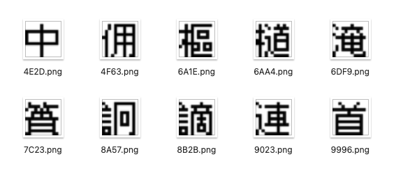
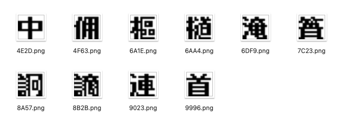
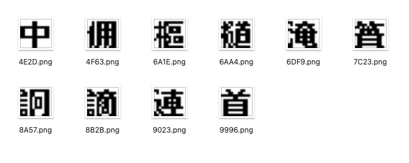
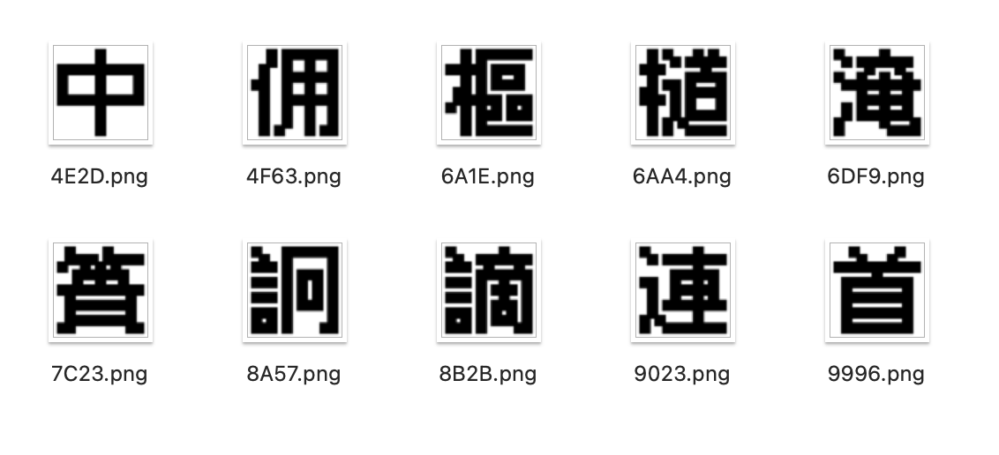

# 像素字形加粗算法

通常情况，小尺寸像素字体的字重都只有 1px（即笔画宽度为 1px）。

有些场景，可能确实需要粗体。可以通过一些算法来实现这个效果。

## 准备 Python

我们使用 [Python](../../setup/python/index.md) 来实现相关算法，借助一个工具库 [Pixel Font Knife](https://github.com/TakWolf/pixel-font-knife)。

`MonoBitmap` 提供了一些便捷的工具方法，可以让我们专注于算法本身。

完整源代码请参考：[pixel-glyph-bolding-algorithm](https://github.com/TakWolf/pixel-font-development-tutorials/tree/master/src/pixel-glyph-bolding-algorithm)

## 准备字形



我们准备了一些字形，用于测试。他们来源于 [方舟像素字体](https://github.com/TakWolf/ark-pixel-font)。字形尺寸为 11*11，右上各留有 1px 间距。

## 偏移重叠阴影剔除算法

名字是我随便起的。

算法大致流程如下：


上图的思路，左侧通过重叠构建了 2px 笔画宽度；而右侧制作了一个阴影。然后左侧图像扣掉右侧阴影。

核心算法如下：

```python
# 右偏移重叠阴影剔除算法
def move_right_and_overlap_bolding(bitmap: MonoBitmap) -> MonoBitmap:
    solid_bitmap = bitmap.resize(left=1).plus(bitmap)
    shadow_bitmap = solid_bitmap.minus(bitmap).resize(left=1)
    result_bitmap = solid_bitmap.minus(shadow_bitmap)
    return result_bitmap
```

效果如下：



同样的，也可以向左执行重叠并剔除阴影，核心算法如下：

```python
# 左偏移重叠阴影剔除算法
def move_left_and_overlap_bolding(bitmap: MonoBitmap) -> MonoBitmap:
    solid_bitmap = bitmap.resize(right=1).plus(bitmap, x=1)
    shadow_bitmap = solid_bitmap.minus(bitmap, x=1).resize(left=-1)
    result_bitmap = solid_bitmap.minus(shadow_bitmap)
    return result_bitmap
```

效果如下：



两种偏移效果给人的感觉是相同的，但是由于方向不同，细节会有一些差异。

需要注意，该算法加粗后，字形宽度会增加 1px。原尺寸 12 * 12 的字形，变换后是 13 * 12。相应的字体参数要对应调整。

据说该算法是 Java 内置 GUI 的加粗算法。这个我没有验证，不是很确定。

## 笔画膨胀算法

名字是我随便起的。

思路是，首先将字形放大，然后让笔画的像素向上下左右四个方向延展。

一般来说，需要把字形放大 4 倍，然后笔画延展 1px。

也就是说，加粗后，原始笔画宽度 1px * 4 + 2px = 6px，而空隙为 1px * 4 -2px = 2px。

核心算法：

```python
def inflation_bolding(bitmap: MonoBitmap) -> MonoBitmap:
    result_bitmap = bitmap.scale(scale_x=4, scale_y=4).resize(left=1, right=1, top=1, bottom=1).stroke(1)
    return result_bitmap
```

效果如下：



## 附录

文章部分内容参考了 [「无用教程 - 游戏汉化时使用的像素字体」](https://sndream.github.io/pixel/pixel-fonts-used-in-chinese.html#pixel-fonts-used-in-chinese)。
