# 搭建 Python 3 环境

本文需要完成以下目标：

1. 安装 Python 3（3.12 或以上版本）
2. 安装一个趁手的代码编写工具（推荐 PyCharm）
3. 了解和使用虚拟环境（venv），并掌握库依赖的安装和管理（pip）
4. 学会断点调试

如果你已掌握上述内容，则可跳过本文。

如果你是初学者，请遵照以下指引。但这并非唯一选择，请根据自身情况和能力水平酌情调整。

## 1. 安装 Python 3

可以直接在 [Python 官方 Downloads 页面](https://www.python.org/downloads/) 下载安装，但是笔者推荐使用包管理器安装 Python。

### Windows 

安装 [Scoop](https://scoop.sh/) 包管理器，然后执行命令：

```shell
scoop install python
```

### MacOS

安装 [Homebrew](https://brew.sh/) 包管理器， 然后执行命令：

```shell
brew install python
```

## 2. 安装 PyCharm

PyCharm 是笔者认为非常好用的 IDE，请在 [官方网站](https://www.jetbrains.com/pycharm/download) 下载并安装。

PyCharm 的 Pro 功能需要付费订阅，但是对于我们来说，我们并不需要 Pro 功能，免费版本足够。

安装后首次启动 PyCharm，会弹出如下页面：

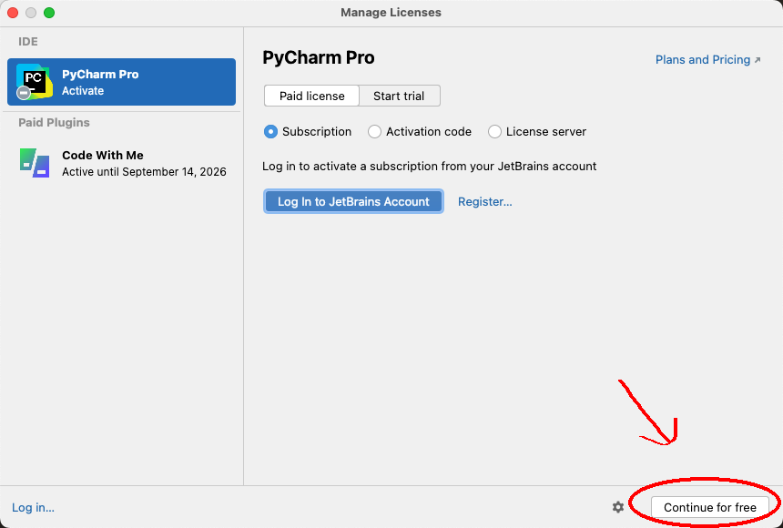

点击右下角的 `Continue for free` 就可以进入免费版本。

## 3. 新建项目

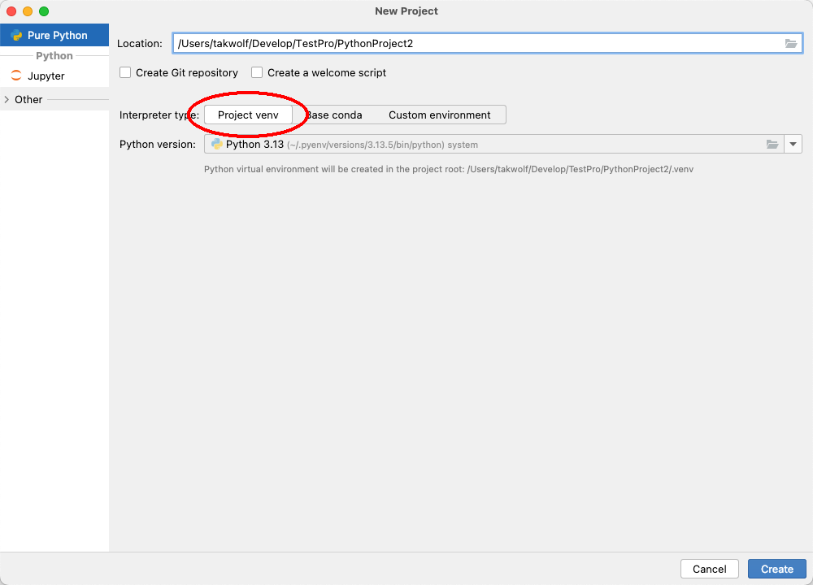

默认情况，PyCharm 会使用 venv 自动帮我们创建一个虚拟环境，这非常方便。

虚拟环境，你可以简单理解为，它是为这个项目而创建的一个独立的执行环境，和全局环境隔离。

所有的依赖都会安装到这个项目的隔离环境中，这样每个项目都会有自己的执行环境，而不会互相冲突。

这里我们不会深入探究虚拟环境，但是我强烈建议你花一点时间阅读一些额外的文章来加强理解，例如这篇：[「venv --- 虚拟环境的创建」](https://docs.python.org/zh-cn/3.13/library/venv.html)。

项目创建完毕后，项目结构大概是这样的：

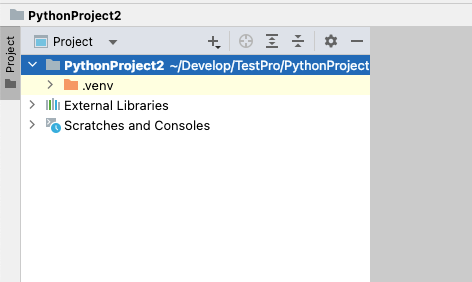

这里的 .venv 目录就是我们创建的虚拟环境，所有的依赖都会安装到这里。

## 4. 通过 pip 安装依赖

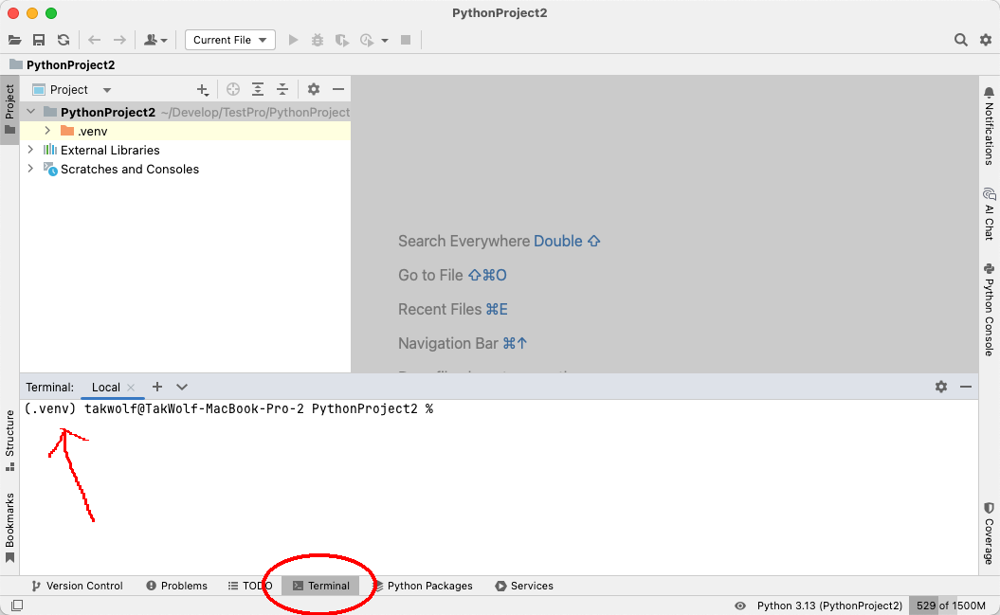

点击底部的 Terminal 选项卡，就会弹出 Terminal 窗口。我们可以在这个窗口，在当前的虚拟环境中执行命令。

你可能注意到，控制台会话前面有一个 `(.venv)` 的前缀，这其实就是表面当前虚拟环境已经生效了。

现在执行:

```shell
pip install unidata-blocks
```

你可以看到如下输出：

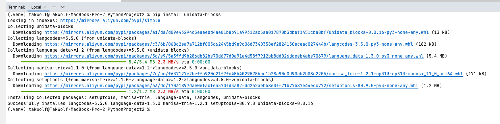

这是我们安装了一个名为 [Unidata Blocks](https://github.com/TakWolf/unidata-blocks) 的依赖库。这个库的功能非常简单，他可以用来快速查询 Unicode 区块。

我们新建一个 main.py 文件，并键入如下代码：

```python
import unidata_blocks


def main():
    block = unidata_blocks.get_block_by_chr('你')
    print(str(block))


if __name__ == '__main__':
    main()
```

这段代码的含义为，查询 `你` 这个字所在的 Unicode 区块，并在控制台打印这个区块信息。

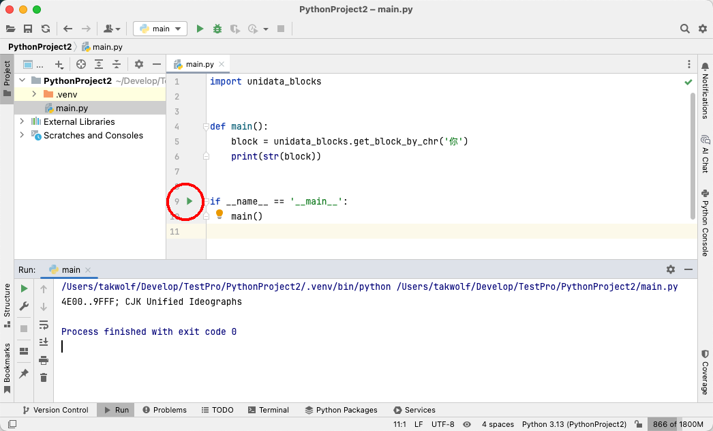

点击上图中红色圆圈中的绿色三角来执行这段代码，你能看到如下输出：

```text
4E00..9FFF; CJK Unified Ideographs
```

恭喜你，你已经完成了第一个 Python 程序。

## 5. 管理依赖

到控制台执行如下命令：

```shell
pip freeze -> requirements.txt
```

你会看到项目目录中生成了一个 `requirements.txt`， 内容大致如下：

```text
langcodes==3.5.0
language_data==1.3.0
marisa-trie==1.2.1
setuptools==80.9.0
unidata-blocks==0.0.16
```

`pip freeze -> requirements.txt` 命令，是将当前虚拟环境中所有的依赖关系，保存到 `requirements.txt` 这个文件中。

这样，之后我们就可以通过：

```shell
pip install -r requirements.txt 
```

直接使用这个文件安装所有的依赖。

点击窗口右下角的 `Interpreter Settings...`

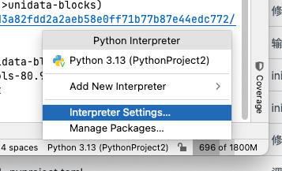

会弹出一个这样的窗口：

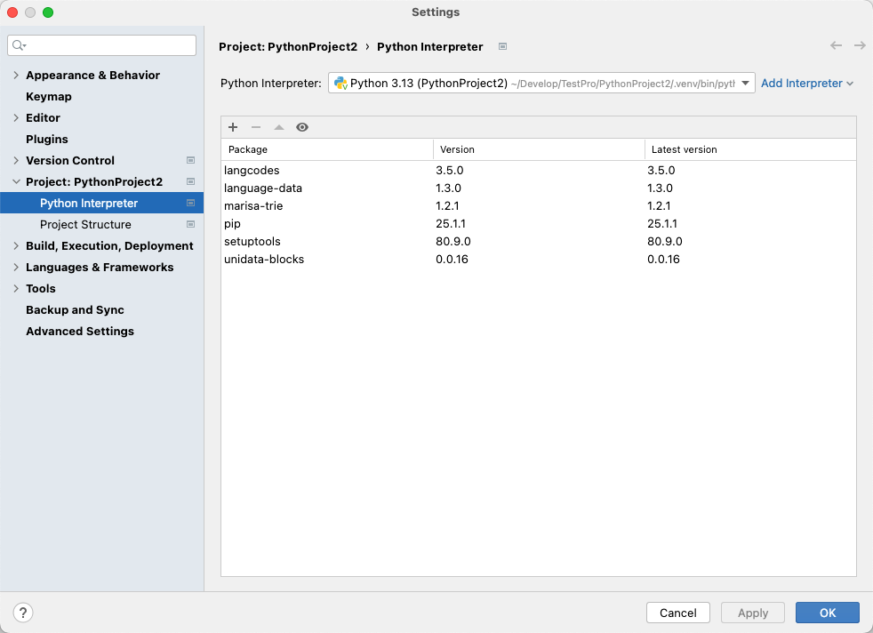

这是我们目前虚拟环境中已经安装的所有依赖，此时这里列出的依赖应该和 `requirements.txt` 文件中描述的一致。

## 6. 断点调试

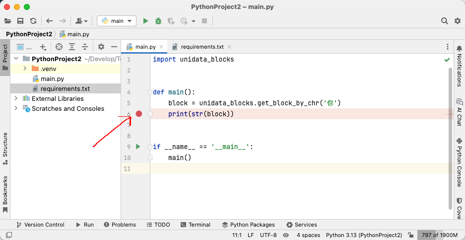

参考上图，鼠标左键点击第6行行号旁边的空白处，这是，会标记一个小红点。

这样，我们就在此处标记了一个断点。程序在执行到这里时，会暂停。

这非常有用，借助这个功能，我们可以快速查看此时程序变量的状态。

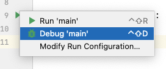

再次点击运行按钮，此时选择第二项 `Debug main`。

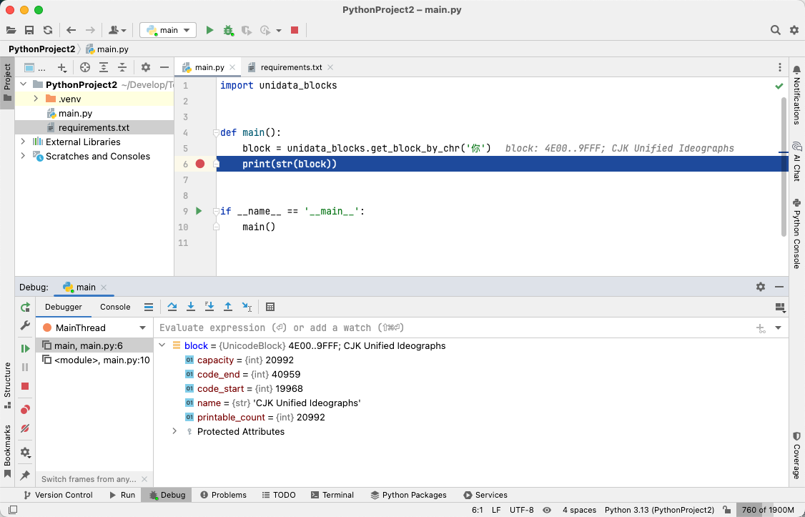

此时，程序暂停到了断点处，并且底部切换到了 `Debug` 窗口。

这时，我们就可以快速查看 `block` 这个变量当前的信息。

## 7. 结束

到此，你已完成了 Python 3 环境的搭建，写出了一个简单的程序，并进行了调试。

你也基本了解了依赖的安装和管理。

在字体的开发中，Python 是一个很重要的工具，我们有非常多的工作需要借助 Python 和一些工具库来实现。

虽然不需要非常高深的编程技巧，但是你需要掌握基本的 Python 能力。

我建议你花一些时间，寻找一些 Python 的基础教程来看看，以加深理解。
