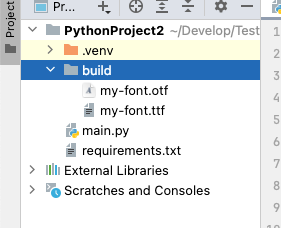

# 构建一个最简单的字体

这个章节，我们来构建一个最简单的字体。

这个字体只包含两个字符，一个大写字母 A，以及一个名为 `.notdef` 的默认字形。

`.notdef` 的作用是，如果需要显示一个字符，而这个字符不存在于字体中，那么渲染引擎就会显示这个字符。

## 使用二维数组绘制字形

我们使用二维数字来绘制这两个字形，我们让 1 代表像素点有颜色，0 代表像素点无颜色。

我们准备下面这一段代码。

```python
def print_bitmap(bitmap: list[list[int]]):
    for bitmap_row in bitmap:
        bitmap_row_string = ''
        for color in bitmap_row:
            if color != 0:
                bitmap_row_string += '**'
            else:
                bitmap_row_string += '  '
        bitmap_row_string += "|"
        print(bitmap_row_string)


def main():
    bitmap_notdef = [
        [1, 1, 1, 1, 1, 1, 1, 1],
        [1, 0, 0, 0, 0, 0, 0, 1],
        [1, 0, 0, 0, 0, 0, 0, 1],
        [1, 0, 0, 0, 0, 0, 0, 1],
        [1, 0, 0, 0, 0, 0, 0, 1],
        [1, 0, 0, 0, 0, 0, 0, 1],
        [1, 0, 0, 0, 0, 0, 0, 1],
        [1, 0, 0, 0, 0, 0, 0, 1],
        [1, 0, 0, 0, 0, 0, 0, 1],
        [1, 0, 0, 0, 0, 0, 0, 1],
        [1, 0, 0, 0, 0, 0, 0, 1],
        [1, 0, 0, 0, 0, 0, 0, 1],
        [1, 0, 0, 0, 0, 0, 0, 1],
        [1, 0, 0, 0, 0, 0, 0, 1],
        [1, 0, 0, 0, 0, 0, 0, 1],
        [1, 1, 1, 1, 1, 1, 1, 1],
    ]

    bitmap_cap_letter_a = [
        [0, 0, 0, 0, 0, 0, 0, 0],
        [0, 0, 0, 0, 0, 0, 0, 0],
        [0, 0, 0, 0, 0, 0, 0, 0],
        [0, 0, 0, 0, 0, 0, 0, 0],
        [0, 0, 0, 1, 1, 0, 0, 0],
        [0, 0, 1, 0, 0, 1, 0, 0],
        [0, 0, 1, 0, 0, 1, 0, 0],
        [0, 1, 0, 0, 0, 0, 1, 0],
        [0, 1, 0, 0, 0, 0, 1, 0],
        [0, 1, 1, 1, 1, 1, 1, 0],
        [0, 1, 0, 0, 0, 0, 1, 0],
        [0, 1, 0, 0, 0, 0, 1, 0],
        [0, 1, 0, 0, 0, 0, 1, 0],
        [0, 1, 0, 0, 0, 0, 1, 0],
        [0, 0, 0, 0, 0, 0, 0, 0],
        [0, 0, 0, 0, 0, 0, 0, 0],
    ]

    print('notdef:')
    print_bitmap(bitmap_notdef)
    print('A:')
    print_bitmap(bitmap_cap_letter_a)


if __name__ == '__main__':
    main()
```

执行后看看得到了什么：

```text
notdef:
****************|
**            **|
**            **|
**            **|
**            **|
**            **|
**            **|
**            **|
**            **|
**            **|
**            **|
**            **|
**            **|
**            **|
**            **|
****************|
A:
                |
                |
                |
                |
      ****      |
    **    **    |
    **    **    |
  **        **  |
  **        **  |
  ************  |
  **        **  |
  **        **  |
  **        **  |
  **        **  |
                |
                |
```

看起来不错对吧。

## 构建第一个字体

现在，在你的 Python 项目中添加一个依赖：

```shell
pip install pixel-font-builder
```

然后编写以下代码：

```python
from pathlib import Path

from pixel_font_builder import FontBuilder, Glyph

project_root_dir = Path(__file__).parent
build_dir = project_root_dir.joinpath('build')
build_dir.mkdir(exist_ok=True)


def main():
    builder = FontBuilder()
    builder.font_metric.font_size = 16
    builder.font_metric.horizontal_layout.ascent = 14
    builder.font_metric.horizontal_layout.descent = -2

    builder.meta_info.version = '1.0.0'
    builder.meta_info.family_name = 'My Font'

    builder.glyphs.append(Glyph(
        name='.notdef',
        horizontal_offset=(0, -2),
        advance_width=8,
        bitmap=[
            [1, 1, 1, 1, 1, 1, 1, 1],
            [1, 0, 0, 0, 0, 0, 0, 1],
            [1, 0, 0, 0, 0, 0, 0, 1],
            [1, 0, 0, 0, 0, 0, 0, 1],
            [1, 0, 0, 0, 0, 0, 0, 1],
            [1, 0, 0, 0, 0, 0, 0, 1],
            [1, 0, 0, 0, 0, 0, 0, 1],
            [1, 0, 0, 0, 0, 0, 0, 1],
            [1, 0, 0, 0, 0, 0, 0, 1],
            [1, 0, 0, 0, 0, 0, 0, 1],
            [1, 0, 0, 0, 0, 0, 0, 1],
            [1, 0, 0, 0, 0, 0, 0, 1],
            [1, 0, 0, 0, 0, 0, 0, 1],
            [1, 0, 0, 0, 0, 0, 0, 1],
            [1, 0, 0, 0, 0, 0, 0, 1],
            [1, 1, 1, 1, 1, 1, 1, 1],
        ],
    ))
    builder.glyphs.append(Glyph(
        name='CAP_LETTER_A',
        horizontal_offset=(0, -2),
        advance_width=8,
        bitmap=[
            [0, 0, 0, 0, 0, 0, 0, 0],
            [0, 0, 0, 0, 0, 0, 0, 0],
            [0, 0, 0, 0, 0, 0, 0, 0],
            [0, 0, 0, 0, 0, 0, 0, 0],
            [0, 0, 0, 1, 1, 0, 0, 0],
            [0, 0, 1, 0, 0, 1, 0, 0],
            [0, 0, 1, 0, 0, 1, 0, 0],
            [0, 1, 0, 0, 0, 0, 1, 0],
            [0, 1, 0, 0, 0, 0, 1, 0],
            [0, 1, 1, 1, 1, 1, 1, 0],
            [0, 1, 0, 0, 0, 0, 1, 0],
            [0, 1, 0, 0, 0, 0, 1, 0],
            [0, 1, 0, 0, 0, 0, 1, 0],
            [0, 1, 0, 0, 0, 0, 1, 0],
            [0, 0, 0, 0, 0, 0, 0, 0],
            [0, 0, 0, 0, 0, 0, 0, 0],
        ],
    ))

    builder.character_mapping[65] = 'CAP_LETTER_A'
    
    builder.save_otf(build_dir.joinpath('my-font.otf'))
    builder.save_ttf(build_dir.joinpath('my-font.ttf'))


if __name__ == '__main__':
    main()
```

先不要管代码的含义，我稍后会给你解释。我们先运行一下。





## 尾声

本章的完整代码位于：[pixel-font-builder/1](https://github.com/TakWolf/pixel-font-development-tutorials/tree/master/src/pixel-font-builder/1)
