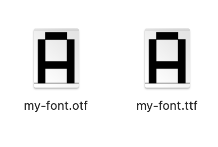

# 构建一个最简单的字体

这个章节，我们来构建一个最简单的字体。

这个字体只包含两个字符，一个大写字母 A，以及一个名为 `.notdef` 的默认字形。

`.notdef` 的作用是，如果需要显示一个字符，而这个字符不存在于字体中，那么渲染引擎就会显示这个字符。

## 使用二维数组绘制字形

我们使用二维数字来绘制这两个字形，我们让 1 代表像素点有颜色，0 代表像素点无颜色。

我们准备下面这一段代码。

```python
def print_bitmap(bitmap: list[list[int]]):
    for bitmap_row in bitmap:
        bitmap_row_string = ''
        for color in bitmap_row:
            if color != 0:
                bitmap_row_string += '**'
            else:
                bitmap_row_string += '  '
        bitmap_row_string += "|"
        print(bitmap_row_string)


def main():
    bitmap_notdef = [
        [1, 1, 1, 1, 1, 1, 1, 1],
        [1, 0, 0, 0, 0, 0, 0, 1],
        [1, 0, 0, 0, 0, 0, 0, 1],
        [1, 0, 0, 0, 0, 0, 0, 1],
        [1, 0, 0, 0, 0, 0, 0, 1],
        [1, 0, 0, 0, 0, 0, 0, 1],
        [1, 0, 0, 0, 0, 0, 0, 1],
        [1, 0, 0, 0, 0, 0, 0, 1],
        [1, 0, 0, 0, 0, 0, 0, 1],
        [1, 0, 0, 0, 0, 0, 0, 1],
        [1, 0, 0, 0, 0, 0, 0, 1],
        [1, 0, 0, 0, 0, 0, 0, 1],
        [1, 0, 0, 0, 0, 0, 0, 1],
        [1, 0, 0, 0, 0, 0, 0, 1],
        [1, 0, 0, 0, 0, 0, 0, 1],
        [1, 1, 1, 1, 1, 1, 1, 1],
    ]

    bitmap_cap_letter_a = [
        [0, 0, 0, 0, 0, 0, 0, 0],
        [0, 0, 0, 0, 0, 0, 0, 0],
        [0, 0, 0, 0, 0, 0, 0, 0],
        [0, 0, 0, 0, 0, 0, 0, 0],
        [0, 0, 0, 1, 1, 0, 0, 0],
        [0, 0, 1, 0, 0, 1, 0, 0],
        [0, 0, 1, 0, 0, 1, 0, 0],
        [0, 1, 0, 0, 0, 0, 1, 0],
        [0, 1, 0, 0, 0, 0, 1, 0],
        [0, 1, 1, 1, 1, 1, 1, 0],
        [0, 1, 0, 0, 0, 0, 1, 0],
        [0, 1, 0, 0, 0, 0, 1, 0],
        [0, 1, 0, 0, 0, 0, 1, 0],
        [0, 1, 0, 0, 0, 0, 1, 0],
        [0, 0, 0, 0, 0, 0, 0, 0],
        [0, 0, 0, 0, 0, 0, 0, 0],
    ]

    print('notdef:')
    print_bitmap(bitmap_notdef)
    print('A:')
    print_bitmap(bitmap_cap_letter_a)


if __name__ == '__main__':
    main()
```

执行后看看得到了什么：

```text
notdef:
****************|
**            **|
**            **|
**            **|
**            **|
**            **|
**            **|
**            **|
**            **|
**            **|
**            **|
**            **|
**            **|
**            **|
**            **|
****************|
A:
                |
                |
                |
                |
      ****      |
    **    **    |
    **    **    |
  **        **  |
  **        **  |
  ************  |
  **        **  |
  **        **  |
  **        **  |
  **        **  |
                |
                |
```

看起来不错对吧。

## 构建第一个字体

现在，在你的 Python 项目中添加一个依赖：

```shell
pip install pixel-font-builder
```

然后编写以下代码：

```python
from pathlib import Path

from pixel_font_builder import FontBuilder, Glyph

project_root_dir = Path(__file__).parent
build_dir = project_root_dir.joinpath('build')
build_dir.mkdir(exist_ok=True)


def main():
    builder = FontBuilder()
    builder.font_metric.font_size = 16
    builder.font_metric.horizontal_layout.ascent = 14
    builder.font_metric.horizontal_layout.descent = -2

    builder.meta_info.version = '1.0.0'
    builder.meta_info.family_name = 'My Font'

    builder.glyphs.append(Glyph(
        name='.notdef',
        horizontal_offset=(0, -2),
        advance_width=8,
        bitmap=[
            [1, 1, 1, 1, 1, 1, 1, 1],
            [1, 0, 0, 0, 0, 0, 0, 1],
            [1, 0, 0, 0, 0, 0, 0, 1],
            [1, 0, 0, 0, 0, 0, 0, 1],
            [1, 0, 0, 0, 0, 0, 0, 1],
            [1, 0, 0, 0, 0, 0, 0, 1],
            [1, 0, 0, 0, 0, 0, 0, 1],
            [1, 0, 0, 0, 0, 0, 0, 1],
            [1, 0, 0, 0, 0, 0, 0, 1],
            [1, 0, 0, 0, 0, 0, 0, 1],
            [1, 0, 0, 0, 0, 0, 0, 1],
            [1, 0, 0, 0, 0, 0, 0, 1],
            [1, 0, 0, 0, 0, 0, 0, 1],
            [1, 0, 0, 0, 0, 0, 0, 1],
            [1, 0, 0, 0, 0, 0, 0, 1],
            [1, 1, 1, 1, 1, 1, 1, 1],
        ],
    ))
    builder.glyphs.append(Glyph(
        name='CAP_LETTER_A',
        horizontal_offset=(0, -2),
        advance_width=8,
        bitmap=[
            [0, 0, 0, 0, 0, 0, 0, 0],
            [0, 0, 0, 0, 0, 0, 0, 0],
            [0, 0, 0, 0, 0, 0, 0, 0],
            [0, 0, 0, 0, 0, 0, 0, 0],
            [0, 0, 0, 1, 1, 0, 0, 0],
            [0, 0, 1, 0, 0, 1, 0, 0],
            [0, 0, 1, 0, 0, 1, 0, 0],
            [0, 1, 0, 0, 0, 0, 1, 0],
            [0, 1, 0, 0, 0, 0, 1, 0],
            [0, 1, 1, 1, 1, 1, 1, 0],
            [0, 1, 0, 0, 0, 0, 1, 0],
            [0, 1, 0, 0, 0, 0, 1, 0],
            [0, 1, 0, 0, 0, 0, 1, 0],
            [0, 1, 0, 0, 0, 0, 1, 0],
            [0, 0, 0, 0, 0, 0, 0, 0],
            [0, 0, 0, 0, 0, 0, 0, 0],
        ],
    ))

    builder.character_mapping[65] = 'CAP_LETTER_A'
    
    builder.save_otf(build_dir.joinpath('my-font.otf'))
    builder.save_ttf(build_dir.joinpath('my-font.ttf'))


if __name__ == '__main__':
    main()
```

先不要管代码的含义，我稍后会给你解释。

我们运行一下，看看发生了什么。

你会看到项目目录出现了一个 `build` 文件夹，并生成了两个字体。




这是两个有效的字体，你可以在系统自带的字体预览工具打开看看效果。当然他只有大写字母 A。

## 解释代码含义

大体来说，上面这段代码，包括五个部分：

1. 设置字体参数（字体尺寸、上升、下降等）
2. 设置字体元信息（版本号、字体名称、作者、版权等）
3. 添加字形
4. 添加 Unicode 编码到字形的映射关系
5. 输出指定的格式

我们一个一个来说。

### 1.设置字体参数

```python
builder = FontBuilder()
builder.font_metric.font_size = 16
builder.font_metric.horizontal_layout.ascent = 14
builder.font_metric.horizontal_layout.descent = -2
```

`font_size` 即字体尺寸。通常来说，在使用时，只有 `font_size` 设置为相同的值，或者整数倍，才能保证渲染时，像素点可以一对一匹配。

`ascent` 和 `descent` 含义为上升和下降，即字体基线上方占用的空间，以及下方占用的空间。`ascent` 和 `descent` 整体占用的空间就是实际字形的行高。

后面会有单独的章节讨论这个问题，目前可以不必深究。

### 2.设置字体元信息

```python
builder.meta_info.version = '1.0.0'
builder.meta_info.family_name = 'My Font'
```

这里我们仅设置了版本号和字体名称（通常是你在软件中看到的名称）。这是字体需要的最小必要信息。

字体可以设置非常多的元信息，如果你希望，可以设置更多，例如：

```python
builder.meta_info.version = '1.0.0'
builder.meta_info.created_time = datetime.fromisoformat('2024-01-01T00:00:00Z')
builder.meta_info.modified_time = builder.meta_info.created_time
builder.meta_info.family_name = 'My Font'
builder.meta_info.weight_name = WeightName.REGULAR
builder.meta_info.serif_style = SerifStyle.SANS_SERIF
builder.meta_info.slant_style = SlantStyle.NORMAL
builder.meta_info.width_style = WidthStyle.MONOSPACED
builder.meta_info.manufacturer = 'Pixel Font Studio'
builder.meta_info.designer = 'TakWolf'
builder.meta_info.description = 'A pixel font'
builder.meta_info.copyright_info = 'Copyright (c) TakWolf'
builder.meta_info.license_info = 'This Font Software is licensed under the SIL Open Font License, Version 1.1'
builder.meta_info.vendor_url = 'https://github.com/TakWolf/pixel-font-builder'
builder.meta_info.designer_url = 'https://takwolf.com'
builder.meta_info.license_url = 'https://openfontlicense.org'
```

### 3.添加字形

```python
builder.glyphs.append(Glyph(
    name='.notdef',
    horizontal_offset=(0, -2),
    advance_width=8,
    bitmap=[
        [1, 1, 1, 1, 1, 1, 1, 1],
        [1, 0, 0, 0, 0, 0, 0, 1],
        [1, 0, 0, 0, 0, 0, 0, 1],
        [1, 0, 0, 0, 0, 0, 0, 1],
        [1, 0, 0, 0, 0, 0, 0, 1],
        [1, 0, 0, 0, 0, 0, 0, 1],
        [1, 0, 0, 0, 0, 0, 0, 1],
        [1, 0, 0, 0, 0, 0, 0, 1],
        [1, 0, 0, 0, 0, 0, 0, 1],
        [1, 0, 0, 0, 0, 0, 0, 1],
        [1, 0, 0, 0, 0, 0, 0, 1],
        [1, 0, 0, 0, 0, 0, 0, 1],
        [1, 0, 0, 0, 0, 0, 0, 1],
        [1, 0, 0, 0, 0, 0, 0, 1],
        [1, 0, 0, 0, 0, 0, 0, 1],
        [1, 1, 1, 1, 1, 1, 1, 1],
    ],
))
builder.glyphs.append(Glyph(
    name='CAP_LETTER_A',
    horizontal_offset=(0, -2),
    advance_width=8,
    bitmap=[
        [0, 0, 0, 0, 0, 0, 0, 0],
        [0, 0, 0, 0, 0, 0, 0, 0],
        [0, 0, 0, 0, 0, 0, 0, 0],
        [0, 0, 0, 0, 0, 0, 0, 0],
        [0, 0, 0, 1, 1, 0, 0, 0],
        [0, 0, 1, 0, 0, 1, 0, 0],
        [0, 0, 1, 0, 0, 1, 0, 0],
        [0, 1, 0, 0, 0, 0, 1, 0],
        [0, 1, 0, 0, 0, 0, 1, 0],
        [0, 1, 1, 1, 1, 1, 1, 0],
        [0, 1, 0, 0, 0, 0, 1, 0],
        [0, 1, 0, 0, 0, 0, 1, 0],
        [0, 1, 0, 0, 0, 0, 1, 0],
        [0, 1, 0, 0, 0, 0, 1, 0],
        [0, 0, 0, 0, 0, 0, 0, 0],
        [0, 0, 0, 0, 0, 0, 0, 0],
    ],
))
```

每个字形都需要一个字形名称，需要注意的是，`.notdef` 是一个约定的名称，你必须这样命名。另外一个大写字母 A 的字形名称你可以随便起，此处我们将它命名为 `CAP_LETTER_A`。

`horizontal_offset` 用来定位字形水平基线的位置，`advance_width` 表示字形占用的实际宽度。后面会有单独的章节讨论这个问题，目前可以不必深究。

`bitmap` 就是我们绘制的位图。

### 4.添加 Unicode 编码到 字形的映射关系

```python
builder.character_mapping[65] = 'CAP_LETTER_A'
```

这里我们添加了一个映射关系。65 是大写字母 A 的 Unicode 编码，我们将它映射到对应的字形名称 `CAP_LETTER_A`。

由于目前只有一个字母，所以只有这一条映射。

你可能注意到，我们没有为 `.notdef` 做映射。这是因为 `.notdef` 是一个约定的名称，你不需要进行映射，字体也能在需要的时候找到它。

### 5.输出指定的格式

```python
builder.save_otf(build_dir.joinpath('my-font.otf'))
builder.save_ttf(build_dir.joinpath('my-font.ttf'))
```

我们输出了两种格式，`otf` 和 `ttf`，这是目前操作系统最流行的两种字体格式。

## 尾声

至此，我们完成了第一个字体的构建。

这是我们踏出的第一步，干杯。

本章的完整代码位于：[pixel-font-builder/1](https://github.com/TakWolf/pixel-font-development-tutorials/tree/master/src/pixel-font-builder/1)
